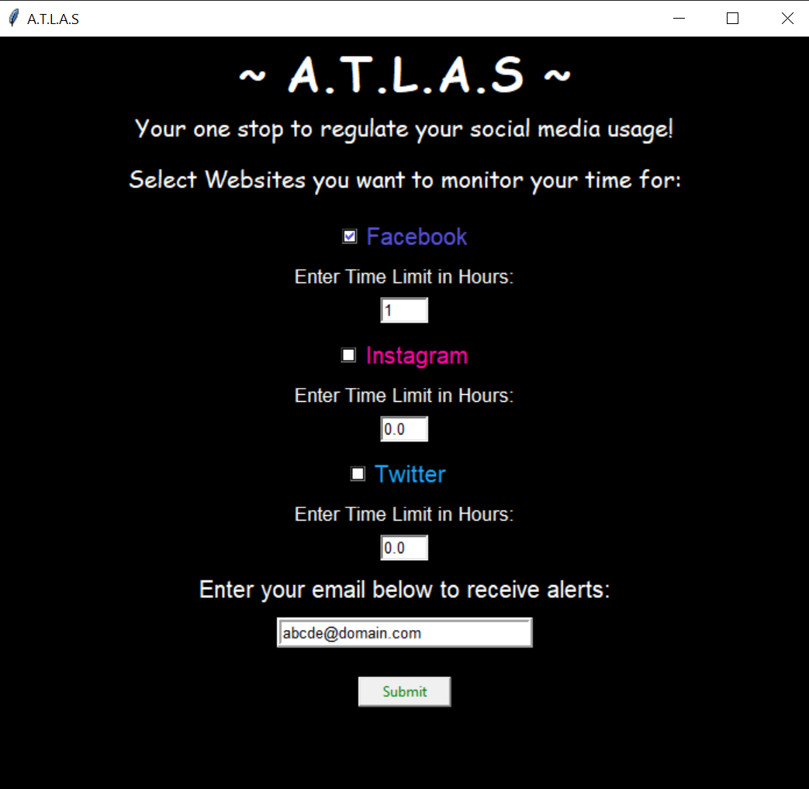

# A.T.L.A.S (Application Time Limit Alerting System)

Idea:
Managing usage time of various apps/sites/softwares (by beep alerts and mail).

Introduction
ATLAS, coded in python, enables users to set maximum and minimum usage time for different applications/websites/softwares. Users can add multiple apps,websites (by their name) along with their max or/and min time of usage. The user will be alerted when the max time limit is crossed or min limit is not achieved. In max time exceeding case, a beep sound will continue whenever that app is on foreground (active) after the limit is reached. In min time case the minimum time usage and total time will be set by the user, a reminder will pop up on fixed intervals to remind the user to meet the minimum time requirements.
Only active apps (foreground app) will contribute in their usage time. There is also a mail feature which allows one to send email if the max time is exceeded or min time is not met. This feature can be used for parental control, where parents can put limits on their child’s time usage for different apps/websites time usage.

Examples: 

User can put a time limit on their usage of Facebook. After the limit is exceeded, whenever he uses Facebook, that is, it becomes active (comes on foreground)an alert will come and it’ll start beeping.
A user can put minimum time limit of say an hour and total time 5 hours on an educational software. He has to meet the minimum requirement by using this software for atleast an hour in next 5 hours. He will be alerted about it every hour till 5 hours. It’ll also stop he meets the requirement before total time.
Modules:

tkinter: GUI for python.

win32gui: module for native win32 GUI API. Mainly used in this project to get the name of app on the foreground using getForegroundWindow.

smtplib(simple mail transfer protocol library): for mailing features. (Gmail)

winsound:for beep alerts.

time: for setting timers.

_thread: to enablesetting of multiple alerts.

Software Tools:
pycharm
pip
  
  #### Demo Image
  
   

### Requirements and usage
  - Setup a virtual environment. In your virtual environment, create a .env text file and set the 'email' and 'password' variables with your credentials.
  - Enable less security access in your Gmail id that you will be using to send email alerts.
  - Install all the dependencies mentioned in requirements.txt.
  -  Run the main.py file to start the application
  
